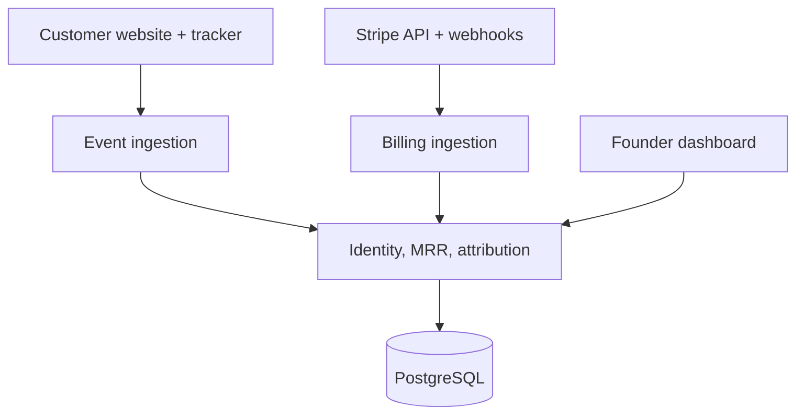

# Architecture

## Status

This document defines the Phase 1 baseline. Decisions that materially change the data contract, security boundary, deployment topology, or MRR semantics require an architecture decision record under `docs/adr/`.

## System shape

MRROrigin begins as a modular monolith backed by PostgreSQL. The browser tracker and web dashboard are independent clients of the API, but revenue, identity, and attribution logic remain in one deployable backend until scale or team ownership creates a measured reason to split them.

## Repository structure

| Path           | Responsibility                                                    |
| -------------- | ----------------------------------------------------------------- |
| `apps/api`     | Spring Boot API, ingestion, business rules, jobs, and persistence |
| `apps/web`     | Authenticated Next.js dashboard and onboarding experience         |
| `apps/tracker` | Small dependency-free browser SDK distributed separately          |
| `docs/adr`     | Immutable records of important architecture decisions             |

## Backend modules

| Module         | Owns                                                      | May depend on               |
| -------------- | --------------------------------------------------------- | --------------------------- |
| `workspace`    | Workspaces, members, projects, reporting settings         | shared kernel only          |
| `tracking`     | Browser events, sessions, touchpoints, ingestion keys     | workspace                   |
| `identity`     | Visitors, external users, aliases, customer links         | workspace, tracking         |
| `billing`      | Stripe connection, raw events, normalized billing objects | workspace                   |
| `revenue`      | MRR snapshots and movements                               | billing                     |
| `attribution`  | Models, evidence, coverage, customer attribution          | tracking, identity, revenue |
| `reporting`    | Read models used by the dashboard and summaries           | attribution, revenue        |
| `notification` | Scheduled summaries and operational notifications         | reporting                   |

Modules expose application services or events. Code must not reach into another module's repository or persistence internals.

## Data flow

### Browser path

1. The tracker receives a public project key.
2. It creates or restores a first-party visitor identifier.
3. It captures the landing URL, referrer, UTM parameters, timestamp, and session context.
4. Events are sent in batches to an idempotent public ingestion endpoint.
5. `identify(externalUserId)` links the anonymous visitor to the customer's application identity without requiring a raw email address.

### Stripe path

1. A workspace authorizes a Stripe account.
2. Initial synchronization imports relevant billing objects and stores a cursor/checkpoint.
3. The webhook endpoint verifies Stripe's signature and writes the raw event before acknowledging it.
4. Asynchronous processing normalizes billing state and creates deterministic MRR movements.
5. The identity module links a Stripe customer to an identified application user using explicit metadata or a server-side identity call.

### Attribution path

1. An eligible MRR movement references its customer and effective timestamp.
2. The attribution engine resolves first-touch and last-touch evidence within the project's configured window.
3. Derived attribution records store the model version, evidence IDs, confidence, and calculation timestamp.
4. Reports aggregate derived results; raw tracking and billing records remain unchanged.

## Attribution evidence

Confidence is based on deterministic evidence, not probabilistic fingerprinting.

| Evidence                                                         | Initial confidence |
| ---------------------------------------------------------------- | ------------------ |
| Visitor ID explicitly carried into Stripe metadata               | Verified           |
| Identified external user explicitly linked to Stripe customer ID | Strong             |
| Approved deterministic alias such as normalized email hash       | Moderate           |
| No deterministic link                                            | Unattributed       |

The exact labels and precedence rules will be finalized with the attribution-engine issue and covered by fixtures.

## Tenancy

- `workspace_id` is required on every tenant-owned aggregate.
- Projects belong to exactly one workspace.
- Public ingestion keys resolve to one project and grant write-only event access.
- Application queries must scope by authenticated workspace before applying client-provided identifiers.
- Cross-tenant uniqueness must never be assumed unless encoded in the schema.
- Tenant-isolation integration tests are required for every new repository or endpoint family.

The Phase 1 migration creates the workspace, membership, and project roots. Authentication integration and request-scoped tenant enforcement are separate backlog items.

## Reliability rules

- External event IDs and Stripe object IDs have unique idempotency constraints.
- Raw provider events are immutable.
- Derived processing is retryable and records attempt/error state.
- Webhooks are acknowledged only after durable receipt.
- Long-running backfills use checkpoints and resumable batches.
- Transactional outbox delivery is preferred over in-transaction network calls.
- Dead records remain inspectable and replayable; they are not silently discarded.

## Storage conventions

- Primary keys are UUIDs.
- Money is stored in integer minor units together with ISO 4217 currency.
- Timestamps are UTC `timestamptz`; project timezone is presentation/reporting configuration.
- External provider payloads use JSONB only at the integration boundary. Core reporting does not query arbitrary provider JSON.
- Migrations are append-only after merge. Never edit an applied migration.
- Personally identifying fields are minimized, classified, and encrypted where storage is unavoidable.

## Security baseline

- Stripe credentials and webhook secrets must be encrypted at rest and must never be logged.
- Public ingestion is rate-limited and constrained by allowed project domains.
- Webhook signatures are verified against the unmodified request body.
- Management APIs use OIDC and enforce workspace membership server-side.
- Logs use internal identifiers instead of email addresses or payment details.
- Data export and deletion are first-class flows before public launch.
- Dependency and secret scanning will be enabled before external beta.

## Deployment baseline

The initial deployment has four operational components:

1. Next.js web application
2. Spring Boot API and background workers in one process
3. Managed PostgreSQL
4. Static/CDN delivery for the tracker bundle

The API must remain horizontally safe: scheduled work uses database leases, ingestion is idempotent, and no correctness-critical state exists only in process memory.

## Architecture decisions

| ADR                                                                | Decision                                                                                         |
| ------------------------------------------------------------------ | ------------------------------------------------------------------------------------------------ |
| [ADR-0001](docs/adr/0001-modular-monolith.md)                      | Start with a modular monolith                                                                    |
| [ADR-0002](docs/adr/0002-immutable-inputs-derived-results.md)      | Separate immutable inputs from derived results                                                   |
| [ADR-0003](docs/adr/0003-stripe-connection-credential-security.md) | Stripe Standard-account OAuth consent (`read_only`) plus platform-key/`Stripe-Account` API calls |

## Deferred decisions

- Production identity provider and session/BFF topology
- Precise MRR normalization and delinquency policy
- Reporting-currency conversion source and historical FX behavior
- Attribution-window defaults and last-direct handling
- Tracker storage mode and consent configuration
- Hosting vendors and regional data residency
